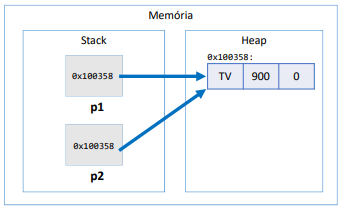
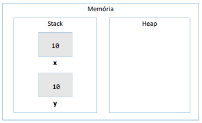

(Conteúdo disponivel na aula 87 e 88)

# Tipos referência vs. tipos valor

## Referência

### Classes são do tipo refêrencia.  
Variáveis que são classes não devem ser entendidas como "caixas", mas sim como "tentáculos" (ponteiros) para caixas.  
Classes são tipos referência

Como funciona na memória?



```
Product p1, p2;
p1 = new Product("TV", 900.00, 0);
p2 = p1;
```

- A área de `stack` aloca variáveis declaradas no programa.  
- A área de `heap` aloca objetos em tempo de execução.  

Isso é a alocação dinâmica de memória.

stack aloca variaveis declaradas no programa
heap aloca objeto em tempo de execução
(alocação dinamica de memória)

Um exemlo de alocação dinâmica de memória:  

```
Product p1, p2;

p1 = new Product("TV", 900.00, 0);
```

Memória:

|  stack   |        heap        |
| :------: | ------------------ |
| 0x100358 |      0x100358:     |
| ***p1*** | TV  \|  900  \|  0 |
| ***p2*** |                    |

E é por isso que variáveis do tipo classe são referências (ponteiros, tentáculos), elas apontam para um objeto.


### Null
Tipos refêrencia aceitam valor nulo (null). Isso indica que a variavel não aponta pra ninguém.  


## Tipos primitivos são tipos valor
Tipos valor são CAIXAS, não ponteiros!  

Exemplo:



```
double x, y;
// double = tipo primitivo
x = 10;
```

Na memória, ficará dentro de `stack`. A caixinha guardará um valor, não uma referência.

<br>

# Diferença crucial entre tipo referência e tipo valor
Se fizermos:  

```
Quantity x, y;
x = new Quantity(10);
y = x;
```

Dentro da área `stack`, haverá um endereço apontando para o mesmo conteúdo da memória HEAP.

Já se fizermos...  

```
double x, y;
x = 10;
y = x;
```

y receberá uma cópia de x dentro de stack

<br>


# Quais são os tipos primitivos?
- boolean  
- char  
- byte  
- short  
- int  
- long  
- float  
- double  

## Inicialização de tipos primitivos

```
int p;

System.out.println(p);
```

Isso dará erro, já que a variável não foi iniciada.

---

## Valores padrão
Quando alocamos (new) qualquer tipo estruturado (classe ou array), são atribuidos alguns valores padrão.  
- Números = 0
- Boolean = false
- Char = caractere codigo 0
- Objeto = null

<br>

# Resumindo... tipo referência vs tipo valor
| Referência (classe)                                                          | Valor (primitivo)                                                |
| ---------------------------------------------------------------------------- | ---------------------------------------------------------------- |
| Ponteiros                                                                    | Caixas                                                           |
| Instanciar                                                                   | Não instanciar                                                   |
| Aceita null                                                                  | Não aceita null                                                  |
| y = x  \|  y aponta para onde x apontar                                      | y = x  \|  y recebe copia de x                                   |
| Objetos instanciados no heap (em tempo de execução)                          | "Objeto" instanciado no stack                                    |
| Se não utilizados, são desalocados num momento futuro pelo garbage collector | Desalocados imediatamente quando escopo de execução é finalizado |


# Desalocação de memória
- Garbage collector
- Escopo local

## garbage collector
É o processo que automatiza o gerenciamento de memória de um programa em execução.    
Ele monitora os objetos alocados dinamicamente pelo programa (na área heap), desalocando aqueles que não estão mais sendo utilizados.  


## Desalocação por escopo
Exemplo:  
Nos condicionais if... se a variável não for declarada fora do escopo do if/else, ela não será usada fora dele.  

Então, na memória, em stack, teremos:  
- O escopo geral  
- O escopo do if  
Quando a execução sair do bloco de comandos de if, a variável declarada dentro dele será automaticamente desalocada da memória.  


Objetos alocados dinamicamente (durante a execução), quando não possuem mais referência para eles, serão desalocados pelo garbage collector.

Variáveis locais são desalocadas imediatamente assim que seu escopo local sai de execução.  

